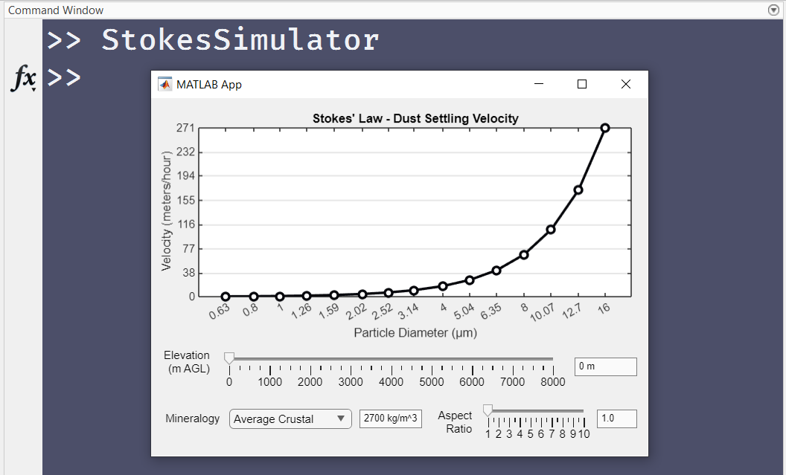

# **Stokes Simulator**
Visualize the settling speeds of dust particles in the atmosphere.



## ℹ **About**
`StokesSimulator` is a graphical user interface designed in MATLAB.

Within the `StokesSimulator` app, particle settling velocities are determined using Stokes' Law, and can be dynamically adjusted by updating the elevation of the particles relative to ground level, or by updating the mineral composition of the particles, or by applying an aspect ratio correction. 

Stokes' Law for the settling velocity of a particle (Vp) takes the form:

```Vp = (2/9) * (r^2 * (rho_p - rho_f) * 9.81) / mu_f```

where `r` is the radius of a particle, `rho_p` is the density of the particle, `rho_f` is the density of the fluid (in this case air), and `mu_f` is the dynamic viscosity of the fluid. The terms `rho_f` and `mu_f` depend on elevation.

`rho_f` and `mu_f` are calculated using data from Engineering Toolbox (https://www.engineeringtoolbox.com/standard-atmosphere-d_604.html).

Mineralogical composition governs the `rho_p` term. Mineral densities were acquired from Gonçalves Ageitos et al. (2023, Atmos. Chem. Phys.). 

The aspect ratio correction is based on the work of Ginoux (2003, JGR Atmos).

## 🛠 **Installation**
Download this repository on your PC and call the `pathtool` function in MATLAB to open the Path Tool app. Use the Path Tool app to add the contents of this repository to the default search path. This will complete your installation and you can then call

```matlab
>> StokesSimulator
```

from the Command Window to open the `StokesSimulator` app.

## 📖 **Documentation**
Documentation for this repository will be housed on the [**Wiki page**](https://github.com/weber1158/StokesSimulator/wiki).

## 🤝 **Contributing**
Contributions are always welcome! Simply:
1. Fork this repository
2. Make your desired changes/additions
3. Submit a pull request

## 👷‍♀️ **Requests and Support**
If you would like to report an error  or file a feature request, please open a new issue on the [**Issues page**](https://github.com/weber1158/StokesSimulator/issues).

For general questions or disscussion, you can open a new discussion on the [**Disucussions page**](https://github.com/weber1158/StokesSimulator/discussions).
